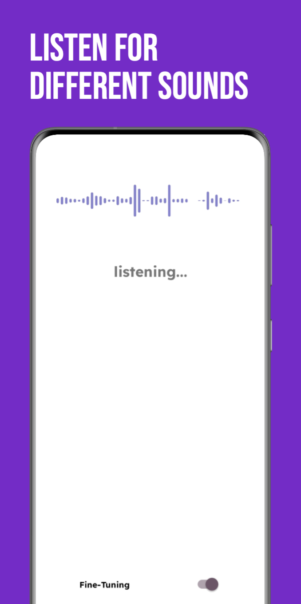
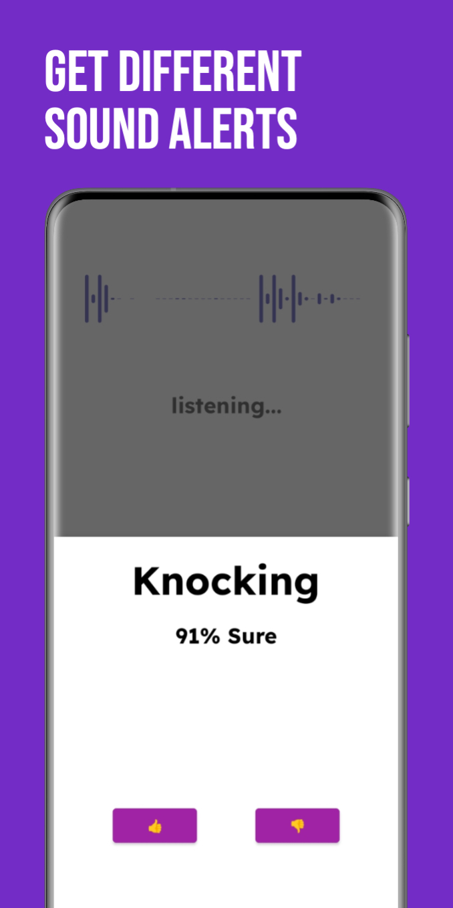
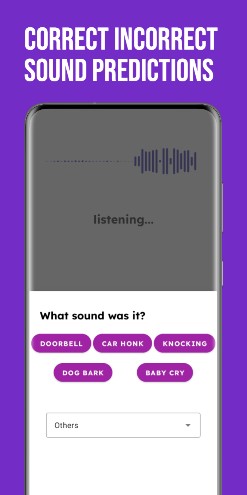
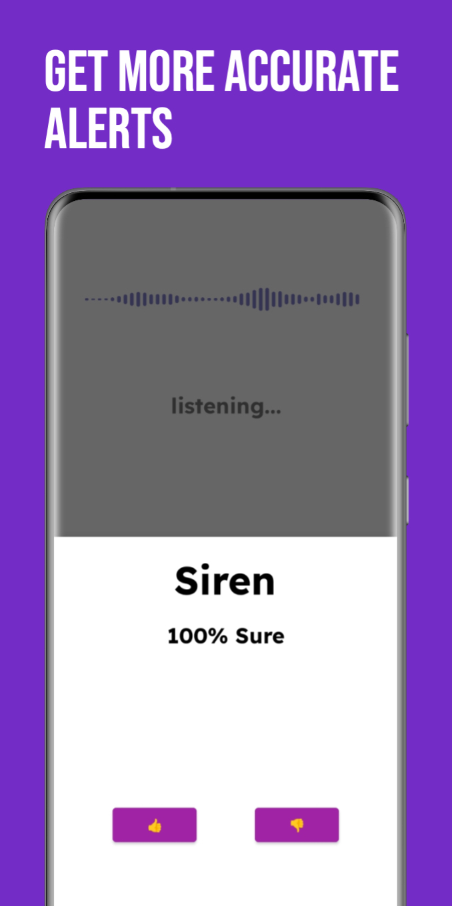

# Adaptive Sound


[](https://polyformproject.org/licenses/noncommercial/1.0.0/)

Copyright © 2024 The Regents of the University of Michigan

This is an alpha version of AdaptiveSound and is still undergoing internal testing. Please bear with us as we update this page with new updates 😃

## Introduction

AdaptiveSound represents an innovative Android application specifically crafted to offer a groundbreaking solution for people who are deaf or hard of hearing (DHH). Diverging from traditional systems relying on pre-trained models from generic datasets, AdaptiveSound introduces a real-time system that empowers users to actively provide corrective feedback. This distinctive feature enables the application to dynamically adjust to the varied acoustic environments encountered by individuals with DHH.

Operating within a reinforcement learning framework, the sound classification model embedded in AdaptiveSound can autonomously update in response to user feedback, facilitating continual adaptive enhancement over time. This seamless integration allows AdaptiveSound to achieve adaptive sound recognition with minimal effort from end-users.


[Paper](https://dl.acm.org/doi/abs/10.1145/3597638.3608390)

## Screenshots

<p float="left">
    
    
    
    
</p>

## File Structure

`android`: the android app that can do sound classification and adaptively fine-tuned in the user's environment.
`tensorflow`: the tf-lite model training and generation code

## Model Setup

Please download the sound classification model file through this [link](https://drive.google.com/file/d/1-c7_m_i7v73OfGobqQYhIIncF2AOJugs/view?usp=share_link) or train your own model following the notebook in the  `tensorflow` directory. The model file should be stored in the path `android/app/src/main/assets/sc_model.tflite`.
## Support
- Developed with [Dhruv Jain](https://web.eecs.umich.edu/~profdj/) and collaborators at [The Accessibility Lab](https://accessibility.eecs.umich.edu)
- Contact [Leo Wu](https://binomial14.github.io) @AccesibilityLab through email `lyuanwu` at umich.edu
- Contact [Hriday Chhabria](https://www.linkedin.com/in/hridayc/) @AccesibilityLab through email `hridayc` at umich.edu

Drop us a note if you are using or plan to use AdaptiveSound for research purposes. We are also happy to help with any questions or issues.

## Acknowledgement
+ The android app part of the project was built based on the tensorflow lite [audio classification](https://github.com/tensorflow/examples/tree/master/lite/examples/audio_classification/android) example.

## Related Work
- [HomeSound](https://makeabilitylab.cs.washington.edu/project/smarthomedhh/): An Iterative Field Deployment of an In-Home Sound Awareness System for Deaf or Hard of Hearing Users
- [SoundWatch](https://github.com/AccessibilityLab/SoundWatch/): An Android-based app designed for commercially available smartwatches to provide glanceable, always-available, and private sound feedback in multiple contexts.

## Citation

Please use the following citation if you want to use AdaptiveSound in your publication.
```
@inproceedings{do2023adaptivesound,
  title={AdaptiveSound: An Interactive Feedback-Loop System to Improve Sound Recognition for Deaf and Hard of Hearing Users},
  author={Do, Hang and Dang, Quan and Huang, Jeremy Zhengqi and Jain, Dhruv},
  booktitle={Proceedings of the 25th International ACM SIGACCESS Conference on Computers and Accessibility},
  pages={1--12},
  year={2023}
}
```